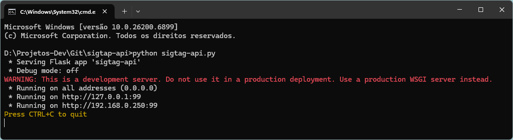

# sigtap-api

## Este é um serviço API para disponibilizar consultas na base de dados do SIGTAP.

### Base de dados

Antes de iniciar o serviço, deve-se adicionar a base de dados, na pasta "data".


### Firebird

Este projeto utiliza o Firebird 1.5 (por compatibilidade com a base de dados do SIGTAP) em modo embarcado.
\
Para isso, existem alguns arquivos do firebird na pasta "fb".

### Instalação/Utilização

1. Abrir o prompt de comando, e efetuar o clone deste repositório:
```
git clone https://github.com/rafap2008/sigtap-api.git
```
2. Ainda no prompt, acessar a pasta clonada:
```
cd c:\sua-pasta\sigtap-api
```
3. Instalar as dependências, executando o arquivo "_Requiriments_Install.bat" ou utilizando o comando:
```
pip install -r requirements.txt
```
4. Iniciar o serviço:
```
python sigtag-api.py
```
Se executado com sucesso, exibirá o IP de acesso.


### Seguem as rotas disponíveis:

* /
* /rotas
* /lista-tabelas
* /colunas-tabela/<-tabela->/<-cabecalho->
* /colunas-tabela/<-tabela->
* /dados-tabela/<-tabela->/<-cabecalho->
* /dados-tabela/<-tabela->
* /consulta/<-script->/<-cabecalho->
* /consulta/<-script->

#### Observação 1

As rotas informadas acima são exemplo, e podem estar desatualizadas.
\
Para verificar todas a rotas corretamente, deve-se executar o serviço e acessar a rota printipal (/)

#### Observação 2

### Para as APIs que possuem o parâmetro "cabecalho", pode-se informar:

* "U" = "Único" - Para retornar o cabeçalho em um registro, e os dados nos demais registros (simulando uma planilha).
\
Exemplo:
\
```
[
  [
    "Nome",
    "Pais"
  ],
  [
    "Rafael Pinheiro",
    "Brasil"
  ],
  [
    "Maria",
    "Itália"
  ]
]
```
* "S" = "Sim" - Para retornar o os nomes das colunas junto dos valores (padrão de um arquivo JSON).
\
Exemplo:
\
```
[
  [
    "Nome": "Rafael Pinheiro",
    "Pais": "Brasil"
  ],
  [
    "Nome": "Maria",
    "Pais": "Itália"
  ]
]
```
* "N" = "Não" - Para retornar apenas os dados, sem os nomes da colunas.
\
Exemplo:
\
```
[
  [
    "Rafael Pinheiro",
    "Brasil"
  ],
  [
    "Maria",
    "Itália"
  ]
]
```
* Ao não informar, o padrão será o modo "Único"


\
O aplicativo funciona com qualquer base de dados firebird, porém pode ser necessário alterar estes arquivos do firebird, para que seja de uma versão compatível com sua base de dados.
